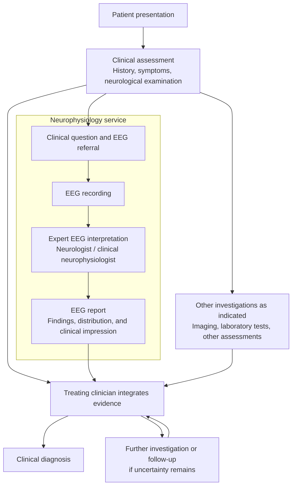
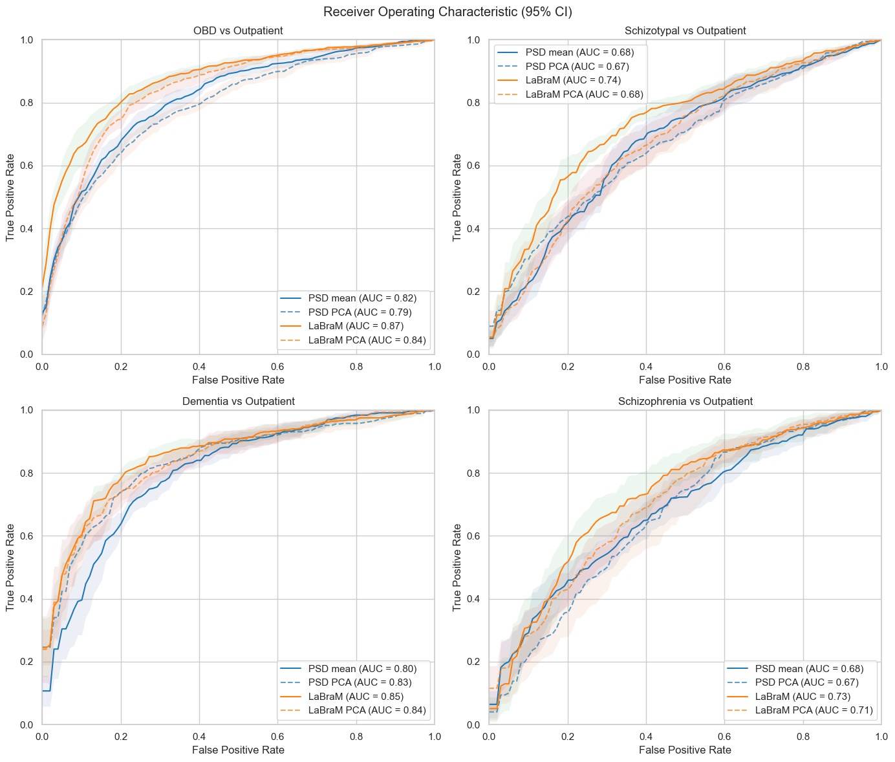
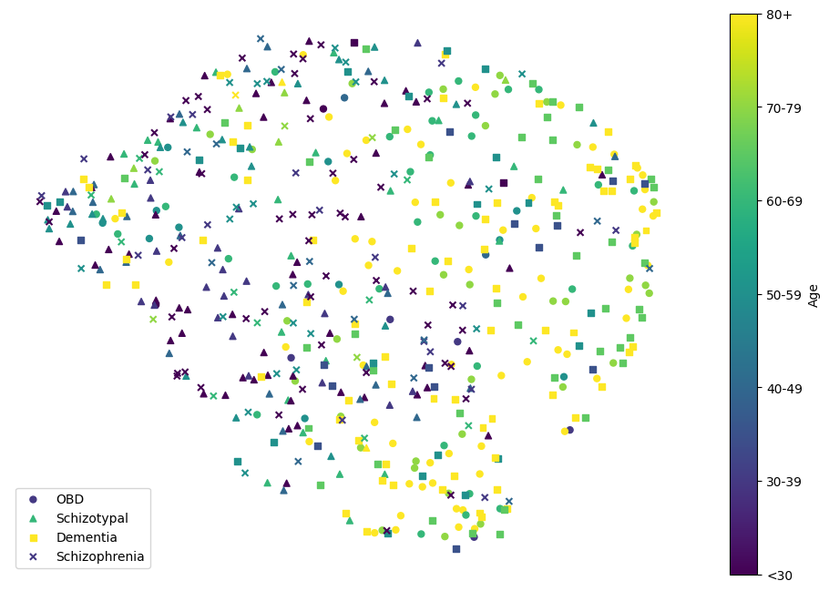
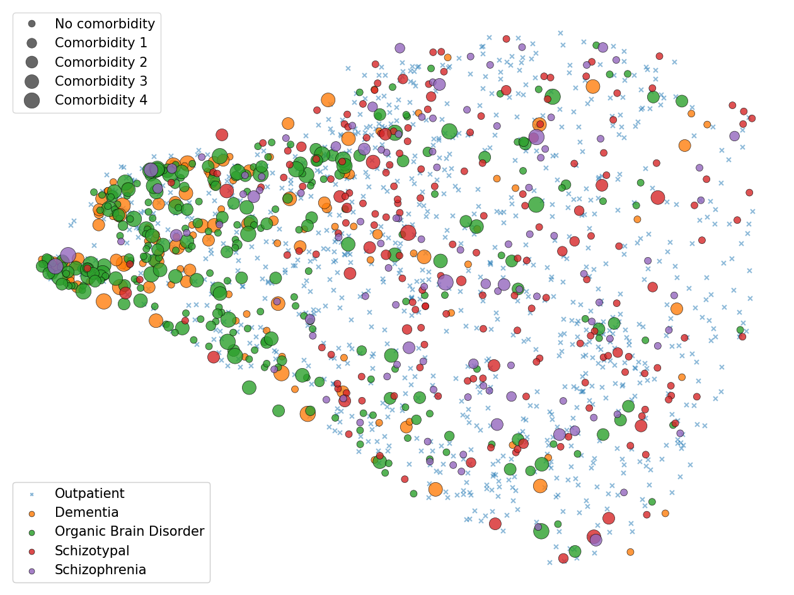
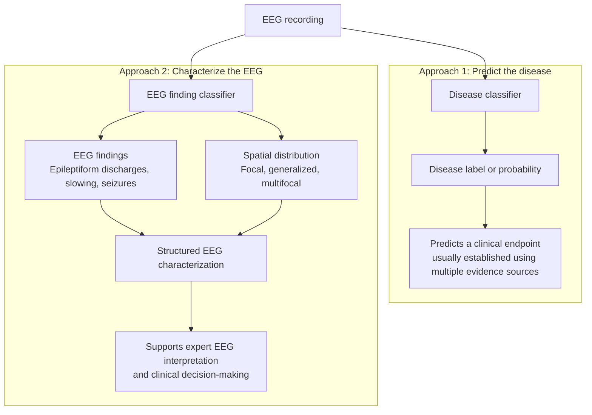

Leading models in popular Temple University dataset (TUBA) can achieve near 90% accuracy. The results looked promising if we focused on narrow EEG abnormality detection. It becomes much harder to interpret when we asked what the model might actually be recognizing. They could simply learn confounding factors rather than disease-specific biomarkers. This short experiment expose a problem in model evaluation: **a model can perform well while doesn't learn meaningful biomarker.**

## Where EEG fits in clinical diagnosis

The central caution is about treating an EEG-based disease prediction as evidence of a disease-specific biomarker. In clinical practice, EEG is one source of evidence within a broader diagnostic process. Diagnostic reasoning starts with the patient's presentation and clinical assessment, before the EEG is ordered.

*Clinical diagnostic workflow. EEG interpretation and the final clinical diagnosis are distinct tasks, even when the same clinician contributes to both.*

The organizational details vary between hospitals, but the separation between EEG reporting and the referring clinician's assessment is reflected in [Cambridge University Hospitals' EEG workflow](https://www.cuh.nhs.uk/patient-information/sleep-electroencephalogram-eeg/). For epilepsy, [NICE guidance](https://www.nice.org.uk/guidance/ng217/chapter/diagnosis-and-assessment-of-epilepsy) recommends EEG to support a clinically suspected diagnosis and help characterize seizure type or syndrome; a normal EEG cannot exclude epilepsy.

## Setup

We used routine clinical EEG recordings from hospitals within Fraser Health Authority in British Columbia. The draft describes adults aged 18–99, with 786 inpatients across four diagnostic categories: organic brain disorder, dementia, schizophrenia, and schizotypal disorder. We compared these with 786 age-matched outpatients sampled from a pool of 23,212.

The diagnostic categories came from Canadian Institute for Health Information case-mix classifications. The comparison group consisted of clinical outpatients, not a separately established healthy population. That distinction matters throughout this note.

We extracted a six-minute resting-state segment from each recording, applied common-average referencing and a 0.5–55 Hz band-pass filter, and resampled to 200 Hz. Each segment was divided into 89 overlapping eight-second windows.

We compared two representations:

- **Pretrained EEG features:** 200-dimensional embeddings from the base LaBraM model, averaged across the windows in each recording.
- **Spectral features:** log absolute power spectral density, summarized into 10 frequency bins per channel across 20 channels, then averaged across windows.

We also evaluated PCA-based variants. For each diagnosis-versus-outpatient task, we trained an SVM using a 70/30 training/evaluation split and repeated the experiment 100 times with different age-matched outpatient samples.

## The classification results looked encouraging

The pretrained features outperformed the mean spectral features in all four comparisons. These are the AUC values printed in the original figure, rounded to two decimal places:

| Inpatient group versus outpatient controls | Mean spectral features | Mean LaBraM features | AUC difference |
| --- | ---: | ---: | ---: |
| Organic brain disorder | 0.82 | 0.87 | +0.05 |
| Dementia | 0.80 | 0.85 | +0.05 |
| Schizotypal disorder | 0.68 | 0.74 | +0.06 |
| Schizophrenia | 0.68 | 0.73 | +0.05 |

*Original draft, Figure 1. Solid curves show the mean-feature comparisons summarized above; dashed curves show the PCA variants. The source figure labels its shaded bands as 95% confidence intervals, but the draft does not explain their construction.*

## What alternative explanation for the score

Machine learning study typically would report the benchmark scores like the one above. Our study take one step further by controlling for patient's age. However, a classifier could still benefit from differences in overall illness burden, medication exposure, vigilance, referral patterns, or recording conditions. These are possible explanations, not effects we measured and isolated. 

There is also an important distinction between a confounder and a genuine but nonspecific physiological signal. General illness-related changes in EEG could be biologically meaningful while still failing to identify the target disease. A model could learn those changes accurately and receive too much credit for disease-specific discrimination.

All these factors make disease prediction need stronger evidence than AUC. To claim a EEG classifier for neurological disorder needs stronger stronger controls:  comparable care settings, assessment of medication and vigilance effects. A better study design would ask whether EEG classifier adds information beyond all clinical variables not just outperform null control test.

We used UMAP to inspect a two-dimensional projection of the learned representations. When the inpatient diagnostic groups were plotted together, they overlapped substantially. There was also visible age-related structure; the draft reported a correlation of *r* = 0.41 between age and UMAP coordinates.

*Figure 3. Diagnostic groups overlap in the projection, while age-related structure is visible. This highlight the need for proper age-control in study design*

When outpatients were included, the projection showed a more apparent distinction between the inpatient and outpatient populations. The draft also reported an association between higher comorbidity and greater distance from controls, with Spearman’s *r*ₛ = 0.39.

*Figure 2. Crosses represent outpatients and circles represent inpatients. Circle size encodes the comorbidity levels used in the original analysis. The question worth asking is whether model learned severity or the actually disease biomarker. *

These observations raised the possibility that broad patient characteristics organized the representation more strongly than the diagnostic categories we wanted to predict.

## A more clinically grounded classification target

Instead of solving the specificity issue, there might be a more  more appealing target for EEG machine learning: characterize the findings in the recording to [support clinical interpretation](https://jamanetwork.com/journals/jamaneurology/fullarticle/2806244). An EEG-only disease classifier instead predicts an endpoint that clinicians usually establish using multiple sources of evidence.

*Two classification targets. EEG finding classification supports the interpretation stage of the clinical workflow; disease classification predicts the downstream diagnostic label.*

Finding type and spatial distribution are not mutually exclusive disease categories: a recording may contain focal epileptiform discharges, generalized slowing, or multiple findings. Their causes still require clinical interpretation. For example, generalized slowing can occur with several underlying conditions and medication effects, as described in the [American Epilepsy Society EEG atlas](https://www.ncbi.nlm.nih.gov/books/NBK390357/).

EEG finding classification is more appealing as a clinical support task because its targets are observable in the recording, its predictions can be checked against specific EEG segments for human validation, and its outputs fit directly into the reporting workflow.
## What this means for EEG benchmarks

This concern motivated our skepticism about neurological disease classification based on purely EEG. If training and test sets preserve the same relationship between labels and population or acquisition differences, a model may generalize across that split without learning the disease-specific information we hope it has learned.

Our experiment did not compare all leading models, or quantify the share of performance attributable to confounding. Claiming that most top models mainly capture confounders would go beyond what our evidence warranted. Although this concern remains a hypothesis, it still worth to raise the attention in future study.

